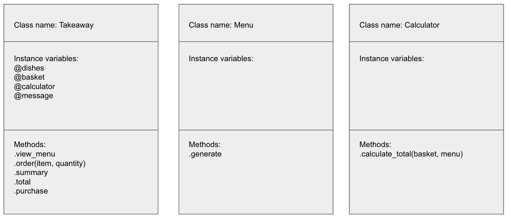
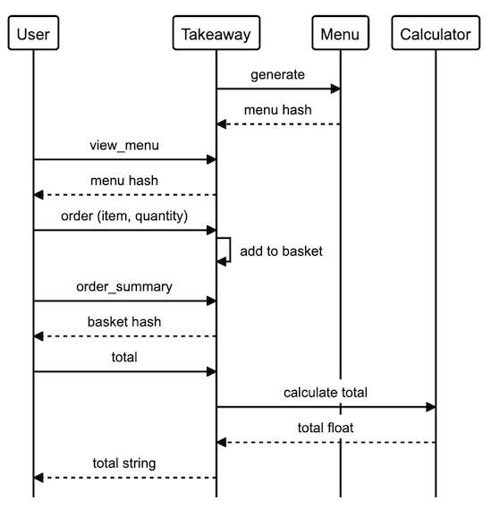
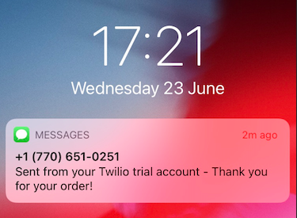
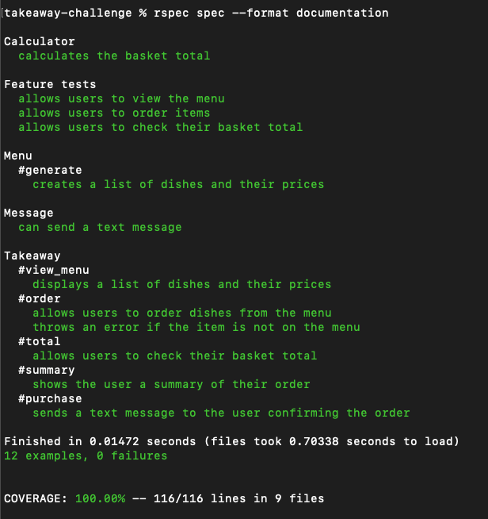

# Takeaway challenge 

```
                            _________
              r==           |       |
           _  //            |  M.A. |   ))))
          |_)//(''''':      |       |
            //  \_____:_____.-------D     )))))
           //   | ===  |   /        \
       .:'//.   \ \=|   \ /  .:'':./    )))))
      :' // ':   \ \ ''..'--:'-.. ':
      '. '' .'    \:.....:--'.-'' .'
       ':..:'                ':..:'

 ```

 # Introduction

This is my solution to the second Makers weekend challenge where the objective is to design a Takeaway shop that allows users to purchse food.

The solution builds on my learnings from the week including TDD, debugging, mocks/doubles & dependancy injection. A particular focus of this exercise was delegation and ensuring class size and function was appropriate. Additionally I learned how to use the Twillio API to send a text message to the user.

My solution:

- all 6 user stories completed
- built entirely through TDD with 100% test coverage
- all RSpec tests passing
- Twillio API used to send a text message to the user

## Solution design 

The following class diagram was created during the planning phase:


The solution is built around a central Takeaway class that is responsible for user interaction and taking the users order. Therefore any function that is not user facing was delegated to another class. 

The Menu class is responsible for generating a menu. This class is injected into the Takeaway class to enable the menu to be changed depending on user requirements. The Calculator class is responsible for calculating the order total.

The following sequence diagram was created during planning phase:


An alternative solution whereby an order class takes an order and calculates the total was considered. However, this would spread out the user interaction responsibility to 2 classes and would only allow 1-2 lines of code to be removed from the Takeaway class, therefore this solution was not implemented.

## How to use

#### To set up the project

Clone this repo and then run 

```
bundle install
```

#### To create a Takeaway

Open IRB and load the 'takeaway.rb' file in the 'lib' folder. Instantiate a takeaway by calling Takeaway.new. 

```
takeaway-challenge % irb
2.7.3 :001 > require './lib/takeaway.rb'
 => true 
2.7.3 :002 > takeaway = Takeaway.new
 => #<Takeaway:0x00007fd6cfcf63b0 @dishes={"Salad"=>1.0, "Soup"=>2.0, "Pas... 
```
#### Takeaway methods

- view the menu using .view_menu
```
2.7.3 :003 > takeaway.view_menu
 => {"Salad"=>1.0, "Soup"=>2.0, "Pasta"=>5.0, "Pizza"=>7.0} 
```

- order items using .order(item, quantity)

```
2.7.3 :005 > takeaway.order("Salad")
 => "1 Salad(s) added to your basket" 
2.7.3 :006 > takeaway.order("Pizza", 2)
 => "2 Pizza(s) added to your basket" 
```

- view a summary of your basket using .summary

```
2.7.3 :007 > takeaway.summary
 => {"Salad"=>1, "Pizza"=>2} 
```

- view the cost of your order with .total

```
2.7.3 :008 > takeaway.total
 => "Total £15.00" 
```

- complete the order with .purchase 

```
2.7.3 :009 > takeaway.purchase
```

This will send a text message to the user (program need to be updated with valid Twillio account and phone numbers)



## Testing

All testing was carried out in RSpec with a summary as follows:


## User stories

The following user stories were implemented as part of this project:

```
As a customer
So that I can check if I want to order something
I would like to see a list of dishes with prices

As a customer
So that I can order the meal I want
I would like to be able to select some number of several available dishes

As a customer
So that I can verify that my order is correct
I would like to check that the total I have been given matches the sum of the various dishes in my order

As a customer
So that I am reassured that my order will be delivered on time
I would like to receive a text such as "Thank you! Your order was placed and will be delivered before 18:52" after I have ordered
```

## Further work

The majority of functionality exists, time permitting I would have added:
- better looking UI for the menu and basket, move from a hash to well formatted strings
- add a more functional checkout where the user can enter their number for the sms confirmation 
- ability to remove an item from the order or change quantity 
- more detail in the text message confirmation perhaps including order total, expcted delivery time and/or order summary

Original README [here](https://github.com/makersacademy/takeaway-challenge)
